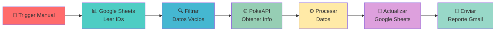

# 🚀 WorkFlows n8n

<div align="center">


### ⚡ Automatización Inteligente con n8n

_Workflows poderosos para simplificar tu vida digital_

[](https://n8n.io)
[](https://sheets.google.com)
[](https://postman.com)
[](https://gmail.com)

---

### 🌟 **Convierte tareas repetitivas en flujos automatizados**

</div>

## 📋 Índice

- [🎯 Acerca del Proyecto](#-acerca-del-proyecto)
- [🛠️ Workflows Disponibles](#%EF%B8%8F-workflows-disponibles)
- [🚀 Instalación y Configuración](#-instalación-y-configuración)
- [📖 Uso](#-uso)
- [🔧 Requisitos](#-requisitos)
- [🤝 Contribuir](#-contribuir)
- [📄 Licencia](#-licencia)

---

## 🎯 Acerca del Proyecto

Este repositorio contiene una colección de **workflows de n8n** diseñados para automatizar tareas comunes y procesos de integración entre diferentes servicios. Cada workflow está optimizado para ser reutilizable y fácil de configurar.

<div align="center">

### 💡 **¿Por qué usar estos workflows?**

|  🚀 **Eficiencia**   | 🔄 **Automatización** |   🛡️ **Confiabilidad**    |
| :------------------: | :-------------------: | :-----------------------: |
| Reduce tiempo manual |  Ejecuta tareas 24/7  | Manejo robusto de errores |

</div>

---

## 🛠️ Workflows Disponibles

### 1. 🐾 **Pokémon Data Processor**

> _Automatización completa de gestión de datos Pokémon_

<details>
<summary>📱 <strong>Ver Detalles del Workflow</strong></summary>

#### 🔄 **Flujo del Proceso:**



#### ✨ **Características:**

- 📥 **Lectura automática** de IDs desde Google Sheets
- 🔍 **Filtrado inteligente** de registros incompletos
- 🌐 **Integración con PokeAPI** para obtener datos actualizados
- 📝 **Actualización automática** de hojas de cálculo
- 📧 **Notificaciones por email** con resumen del proceso
- 🗂️ **Agregación de resultados** para reportes

#### 📊 **Datos Procesados:**

- 🆔 ID del Pokémon
- 📛 Nombre
- 🏷️ Tipo principal
- 🖼️ Sprites (frontal y posterior)

</details>

---

## 🚀 Instalación y Configuración

### 📋 **Prerrequisitos**

<div align="center">

|                                             Herramienta                                             | Versión |     Propósito      |
| :-------------------------------------------------------------------------------------------------: | :-----: | :----------------: |
|                    | Latest  | Motor de workflows |
|           |   16+   |      Runtime       |
|  |    -    |   APIs de Google   |

</div>

### 🔧 **Configuración Paso a Paso**

#### 1️⃣ **Instalar n8n**

```bash
# Instalación global
npm install n8n -g

# O usando npx (recomendado)
npx n8n
```

#### 2️⃣ **Configurar Credenciales de Google**

```bash
# 1. Crear proyecto en Google Cloud Console
# 2. Habilitar APIs necesarias:
#    - Google Sheets API
#    - Gmail API
# 3. Crear credenciales OAuth 2.0
# 4. Descargar archivo de configuración
```

#### 3️⃣ **Importar Workflows**

1. 📂 Abrir n8n en tu navegador
2. 📥 Ir a **Import from file**
3. 📋 Seleccionar archivo del workflow
4. ⚙️ Configurar credenciales necesarias

---

## 📖 Uso

### 🚀 **Ejecutar el Workflow de Pokémon**

#### Método 1: **Ejecución Manual**

```bash
# 1. Abrir n8n
npx n8n

# 2. Cargar el workflow 'pokemon'
# 3. Configurar credenciales de Google
# 4. Hacer clic en "Execute Workflow"
```

#### Método 2: **Ejecución Programada**

- ⏰ Configurar un **Cron Trigger**
- 📅 Establecer horarios de ejecución
- 🔄 Automatización completa

### 📊 **Estructura de Datos**

#### Google Sheets (Entrada):

```json
{
  "ID": "1",
  "Nombre": "",
  "Tipo": "",
  "Sprite Frontal": "",
  "Sprite Posterior": ""
}
```

#### Resultado Procesado:

```json
{
  "id": 1,
  "name": "bulbasaur",
  "type": "grass",
  "photos": {
    "front": "https://...",
    "back": "https://..."
  }
}
```

---

## 🔧 Requisitos

### 📋 **Configuraciones Necesarias**

<div align="center">

#### 🔑 **Credenciales Requeridas**

|                                        Servicio                                         |  Tipo   |            Uso             |
| :-------------------------------------------------------------------------------------: | :-----: | :------------------------: |
|  | OAuth2  | Lectura/Escritura de datos |
|             | OAuth2  |     Envío de reportes      |
|         | Público |     Obtención de datos     |

</div>

### 🛡️ **Seguridad**

> ⚠️ **Importante:** Nunca commitees archivos `client_secret.*` al repositorio. Estos están incluidos en `.gitignore` por seguridad.

---

## 🎨 **Personalización**

### 🔧 **Modificar Workflows**

```javascript
// Ejemplo: Cambiar campos extraídos
{
  "assignments": [
    {
      "name": "custom_field",
      "value": "={{ $json.custom_data }}",
      "type": "string"
    }
  ]
}
```

### 📊 **Añadir Nuevos Datos**

1. 🎯 Identificar nueva fuente de datos
2. 🔗 Configurar nodo HTTP Request
3. ⚙️ Añadir procesamiento con nodo Set
4. 📝 Actualizar mapeo de Google Sheets

---

## 🌟 **Características Destacadas**

<div align="center">

### 🚀 **Beneficios Clave**

|     Feature      | Descripción                         |  Impacto   |
| :--------------: | :---------------------------------- | :--------: |
| 🔄 **Auto-sync** | Sincronización automática de datos  | ⭐⭐⭐⭐⭐ |
| 📊 **Reporting** | Reportes automáticos por email      |  ⭐⭐⭐⭐  |
| 🔍 **Filtrado**  | Procesamiento inteligente de datos  | ⭐⭐⭐⭐⭐ |
| 📱 **Multi-API** | Integración con múltiples servicios | ⭐⭐⭐⭐⭐ |

</div>

---
