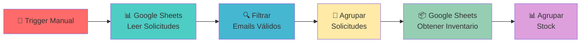
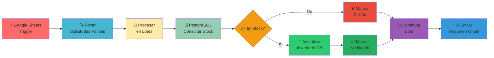
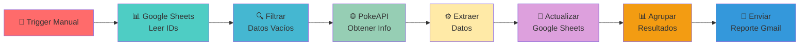

# 🚀 WorkFlows n8n

<div align="center">


### ⚡ Automatización Inteligente con n8n

_Workflows poderosos para simplificar tu vida digital_

[](https://n8n.io)
[](https://sheets.google.com)
[](https://postman.com)
[](https://gmail.com)

---

### 🌟 **Convierte tareas repetitivas en flujos automatizados**

</div>

## 📋 Índice

- [🎯 Acerca del Proyecto](#-acerca-del-proyecto)
- [🛠️ Workflows Disponibles](#%EF%B8%8F-workflows-disponibles)
- [🚀 Instalación y Configuración](#-instalación-y-configuración)
- [📖 Uso](#-uso)
- [🔧 Requisitos](#-requisitos)
- [🤝 Contribuir](#-contribuir)
- [📄 Licencia](#-licencia)

---

## 🎯 Acerca del Proyecto

Este repositorio contiene una colección de **workflows de n8n** diseñados para automatizar tareas comunes y procesos de integración entre diferentes servicios. Cada workflow está optimizado para ser reutilizable y fácil de configurar.

<div align="center">

### 💡 **¿Por qué usar estos workflows?**

|  🚀 **Eficiencia**   | 🔄 **Automatización** |   🛡️ **Confiabilidad**    |
| :------------------: | :-------------------: | :-----------------------: |
| Reduce tiempo manual |  Ejecuta tareas 24/7  | Manejo robusto de errores |

</div>

---

## 🛠️ Workflows Disponibles

### 1. � **Google Forms - T-shirt (Básico)**

> _Sistema simple de gestión de solicitudes de camisetas_

<details>
<summary>📱 <strong>Ver Detalles del Workflow</strong></summary>

#### 🔄 **Flujo del Proceso:**



#### ✨ **Características:**

- 📥 **Lectura automática** de solicitudes desde Google Forms
- 🔍 **Filtrado de solicitudes** con email válido
- 📦 **Consulta de inventario** en tiempo real
- 📊 **Agregación de datos** para análisis
- 🗂️ **Gestión dual de hojas** (solicitudes + inventario)

#### 🛠️ **Servicios Utilizados:**
- **Google Sheets API**: Lectura de solicitudes e inventario
- **OAuth 2.0**: Autenticación con Google

</details>

---

### 2. 👕 **Google Forms - T-shirt PSQL (Avanzado)**

> _Sistema completo de gestión automatizada de inventario de camisetas con base de datos_

<details>
<summary>📱 <strong>Ver Detalles del Workflow</strong></summary>

#### 🔄 **Flujo del Proceso:**



#### ✨ **Características:**

- ⚡ **Trigger automático** al agregar nuevas filas en Google Sheets
- 🗄️ **Base de datos PostgreSQL** para control de inventario
- 🔄 **Procesamiento en lotes** para optimizar rendimiento
- ✅ **Control de existencias** en tiempo real
- 📧 **Notificaciones automáticas** por Gmail con resumen
- 📝 **Actualización de estado** en Google Sheets
- 🔍 **Validación completa** de solicitudes

#### 🛠️ **Servicios Utilizados:**
- **Google Sheets API**: Lectura y escritura de solicitudes
- **Google Sheets Trigger**: Detección automática de cambios
- **PostgreSQL**: Base de datos para inventario
- **Gmail API**: Envío de notificaciones
- **OAuth 2.0**: Autenticación con servicios Google

#### 📊 **Campos Procesados:**
- 📧 Dirección de correo electrónico
- 👕 Talla de camiseta
- ✅ Estado de verificación
- 📅 Fecha de verificación

</details>

---

### 3. �🐾 **Pokémon Data Processor**

> _Automatización completa de gestión de datos Pokémon usando API externa_

<details>
<summary>📱 <strong>Ver Detalles del Workflow</strong></summary>

#### 🔄 **Flujo del Proceso:**



#### ✨ **Características:**

- 📥 **Lectura automática** de IDs desde Google Sheets
- 🔍 **Filtrado inteligente** de registros incompletos
- 🌐 **Integración con PokeAPI** para obtener datos actualizados
- 📝 **Actualización automática** de hojas de cálculo
- 📧 **Notificaciones por email** con resumen del proceso
- 🗂️ **Agregación de resultados** para reportes

#### 🛠️ **Servicios Utilizados:**
- **Google Sheets API**: Lectura y escritura de datos Pokémon
- **PokeAPI**: API pública para información de Pokémon
- **Gmail API**: Envío de reportes
- **HTTP Request**: Consultas a API externa

#### 📊 **Datos Procesados:**

- 🆔 ID del Pokémon
- 📛 Nombre
- 🏷️ Tipo principal
- 🖼️ Sprites (frontal y posterior)

</details>

---

## 🚀 Instalación y Configuración

### 📋 **Prerrequisitos**

<div align="center">

|                                             Herramienta                                             | Versión |     Propósito      |
| :-------------------------------------------------------------------------------------------------: | :-----: | :----------------: |
|                    | Latest  | Motor de workflows |
|           |   16+   |      Runtime       |
|  |    -    |   APIs de Google   |

</div>

### 🔧 **Configuración Paso a Paso**

#### 1️⃣ **Instalar n8n**

```bash
# Instalación global
npm install n8n -g

# O usando npx (recomendado)
npx n8n
```

#### 2️⃣ **Configurar Credenciales de Google**

```bash
# 1. Crear proyecto en Google Cloud Console
# 2. Habilitar APIs necesarias:
#    - Google Sheets API
#    - Gmail API
# 3. Crear credenciales OAuth 2.0
# 4. Descargar archivo de configuración
```

#### 2️⃣ **Configurar Base de Datos PostgreSQL (Para T-shirt PSQL)**

```bash
# Opción 1: PostgreSQL Local
# 1. Instalar PostgreSQL
# 2. Crear base de datos 'inventory'
# 3. Crear tabla: CREATE TABLE inventory (id SERIAL, product_name VARCHAR, size VARCHAR, in_stock INT);

# Opción 2: PostgreSQL en la Nube (Recomendado)
# 1. Usar servicios como NeonTech, Supabase, o AWS RDS
# 2. Obtener string de conexión
# 3. Configurar en n8n
```

#### 3️⃣ **Importar Workflows**

1. 📂 Abrir n8n en tu navegador
2. 📥 Ir a **Import from file**
3. 📋 Seleccionar archivo del workflow
4. ⚙️ Configurar credenciales necesarias

---

## 📖 Uso

### 🚀 **Ejecutar Workflows**

#### 👕 **T-shirt Básico** (Ejecución Manual)

```bash
# 1. Abrir n8n
npx n8n

# 2. Importar 'Google Forms - T-shirt.json'
# 3. Configurar credenciales de Google Sheets
# 4. Hacer clic en "Execute Workflow"
```

#### 👕 **T-shirt PSQL** (Automático con Trigger)

```bash
# 1. Configurar base de datos PostgreSQL
# 2. Importar 'Google Forms - T-shirt PSQL.json'  
# 3. Configurar credenciales:
#    - Google Sheets OAuth2
#    - PostgreSQL Connection
#    - Gmail OAuth2
# 4. Activar el workflow - Se ejecuta automáticamente
```

#### � **Pokémon Data Processor** (Manual/Programado)

```bash
# 1. Importar 'pokemon-workflow.json'
# 2. Configurar credenciales de Google
# 3. Ejecutar manualmente o programar con Cron Trigger
```

### 📊 **Estructuras de Datos**

#### 👕 **T-shirt Workflows:**

```json
{
  "Marca temporal": "23/09/2025 13:23:22",
  "Nombre": "Usuario",
  "Talla de camiseta": "M",
  "Dirección de correo electrónico": "user@example.com",
  "Verificado": true,
  "Fecha de verificación": "2025-09-23 14:30"
}
```

#### 🐾 **Pokémon Workflow:**

```json
{
  "id": 1,
  "name": "bulbasaur",
  "type": "grass",
  "photos": {
    "front": "https://raw.githubusercontent.com/PokeAPI/sprites/master/sprites/pokemon/1.png",
    "back": "https://raw.githubusercontent.com/PokeAPI/sprites/master/sprites/pokemon/back/1.png"
  }
}
```

---

## 🔧 Requisitos

### 📋 **Configuraciones Necesarias**

<div align="center">

#### 🔑 **Credenciales Requeridas**

|                                         Servicio                                          |    Tipo    |              Uso               |
| :---------------------------------------------------------------------------------------: | :--------: | :----------------------------: |
|   |   OAuth2   |   Lectura/Escritura de datos   |
|               |   OAuth2   |       Envío de reportes        |
|          |  Público   |       Obtención de datos       |
|  | Conexión DB | Control de inventario avanzado |

</div>

### 🛡️ **Seguridad**

> ⚠️ **Importante:** Nunca commitees archivos `client_secret.*` al repositorio. Estos están incluidos en `.gitignore` por seguridad.

---

## 🎨 **Personalización**

### 🔧 **Modificar Workflows**

```javascript
// Ejemplo: Cambiar campos extraídos
{
  "assignments": [
    {
      "name": "custom_field",
      "value": "={{ $json.custom_data }}",
      "type": "string"
    }
  ]
}
```

### 📊 **Añadir Nuevos Datos**

1. 🎯 Identificar nueva fuente de datos
2. 🔗 Configurar nodo HTTP Request
3. ⚙️ Añadir procesamiento con nodo Set
4. 📝 Actualizar mapeo de Google Sheets

---

## 🌟 **Características Destacadas**

<div align="center">

### 🚀 **Beneficios Clave**

|     Feature      | Descripción                         |  Impacto   |
| :--------------: | :---------------------------------- | :--------: |
| 🔄 **Auto-sync** | Sincronización automática de datos  | ⭐⭐⭐⭐⭐ |
| 📊 **Reporting** | Reportes automáticos por email      |  ⭐⭐⭐⭐  |
| 🔍 **Filtrado**  | Procesamiento inteligente de datos  | ⭐⭐⭐⭐⭐ |
| 📱 **Multi-API** | Integración con múltiples servicios | ⭐⭐⭐⭐⭐ |

</div>

---
